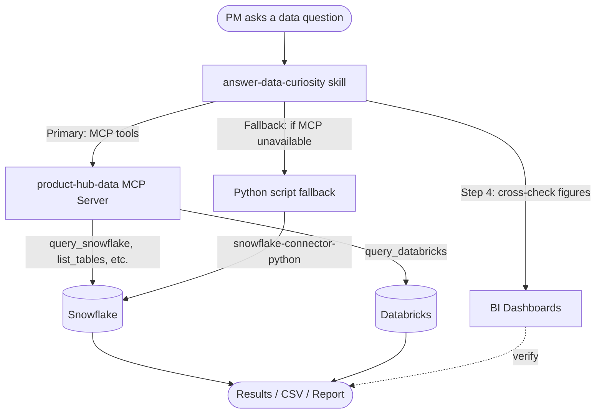

# Answer Data Curiosity — Skill README

## What This Skill Does

Answers ad-hoc data questions by querying your data warehouse (Snowflake). It connects via an MCP server (preferred) or falls back to `snowflake-connector-python` scripts, explores the schema, builds SQL queries, and exports enriched results to CSV.

Falls back to **Databricks** for ML/feature-engineering workloads, directs to the **BI layer** (Power BI / Tableau) for exec reporting, and the **data catalog** (Collibra / similar) for metric definitions. See `SKILL.md` for the full decision table.

## Architecture



**Two query paths:**

| Path | When | How |
| ---- | ---- | --- |
| **MCP Server** (preferred) | MCP server is running in VS Code | Skill calls `query_snowflake()`, `list_tables()`, etc. via the MCP protocol. Persistent connection, SSO authenticates once per session. |
| **Python fallback** | MCP server unavailable | Skill writes and runs a Python script using `snowflake-connector-python` with environment variables. Each run may trigger SSO browser login. |

### Why MCP is preferred

| Factor | MCP Server | Python Fallback |
| ------ | ---------- | --------------- |
| Auth | One SSO login per session, connection reused | Each script may trigger a new browser login |
| Safety | Write/DDL blocked at the server level | Relies on generated SQL being safe (mitigated by read-only role) |
| Artifacts | Zero tmp files — results returned in-memory | Generates `tmp_*.py` files that accumulate in the workspace |
| Speed | Fast after first query — no Python startup overhead | Each script: interpreter startup + connector import + SSO + query |
| Credential risk | Env vars in `.vscode/mcp.json` (gitignored) | Env vars in terminal or risk of hardcoding in scripts |

The fallback is still useful when: the MCP server isn't running, you need a rerunnable/shareable script, or you're doing complex multi-step ETL beyond single queries.

## Prerequisites

### Option A: MCP Server (recommended)

1. **Install dependencies:**

   ```bash
   pip install mcp snowflake-connector-python[secure-local-storage] databricks-sql-connector
   ```

2. **Configure VS Code** — add to `.vscode/mcp.json`:

   ```json
   {
     "servers": {
       "product-hub-data": {
         "type": "stdio",
         "command": "python",
         "args": ["${workspaceFolder}/mcp-servers/snowflake_server.py"]
       }
     }
   }
   ```

3. **Set environment variables** (see below). The MCP server reads them on startup.
4. **Start the server** — VS Code starts it automatically when a tool is invoked. The first call triggers SSO login via browser.

See [`mcp-servers/README.md`](../../mcp-servers/README.md) for full MCP server documentation.

### Option B: Python Fallback

1. **Install:**

   ```bash
   pip install snowflake-connector-python[secure-local-storage]
   ```

2. **Set environment variables** (see below). The skill generates and runs scripts directly.

### Environment Variables

```powershell
$env:SNOWFLAKE_ACCOUNT = "<your_account>"
$env:SNOWFLAKE_USER = "<your_email>"
$env:SNOWFLAKE_AUTHENTICATOR = "externalbrowser"
$env:SNOWFLAKE_ROLE = "<your_role>"
$env:SNOWFLAKE_WAREHOUSE = "<your_warehouse>"
$env:SNOWFLAKE_DATABASE = "<your_database>"
$env:SNOWFLAKE_SCHEMA = "<your_default_schema>"
```

See `private/data-access.md` for your company-specific values (gitignored, shared manually).

## How to Use

1. Open the `answer-data-curiosity` skill in Copilot chat.
2. Set your Snowflake environment variables in the terminal.
3. Ask any data question — usage, revenue, accounts, products, trends.
4. The skill will explore the schema, build SQL, execute queries, and present results.
5. For bulk exports, it generates CSV files in the workspace root.

## Key Concepts

| Concept | Description |
| ------- | ----------- |
| Account dimension | Maps account IDs to company names and hierarchy |
| Usage/interval table | Product usage sessions (user ID, product ID, project ID, duration) |
| User dimension | User directory (ID, name, email, current-row flag for SCD2) |
| Product dimension | Product ID → product name mapping |

### Common Patterns

- **Account lookup:** Search the account dimension by name (ILIKE) to find account IDs
- **User resolution:** Join usage tables to user dimension on user ID; filter `IS_CURRENT_ROW = TRUE`
- **Duration conversion:** Usage duration is typically in minutes — divide by 60 for hours
- **LEFT JOIN for users:** Some user IDs in usage tables don't exist in the user dimension (stale/migrated); always use LEFT JOIN

## Customization

To adapt this skill for your company:

1. Create `private/data-access.md` with your Snowflake/Databricks connection details
2. Place sample queries in `private/sample-queries/snowflake/` and `private/sample-queries/databricks/`
3. Create `private/account-product-insights-template.md` with your company-specific table/column names
4. Update product IDs and account dimension names to match your schema

## Example Use Cases

- "How many active users does Account X have on Product Y?"
- "What's the MAU trend for Product Z over the last 12 months?"
- "Who are the top users at Account X by hours spent?"
- "What's the revenue breakdown by product family for Q2?"
- "Which accounts have declining usage month-over-month?"
